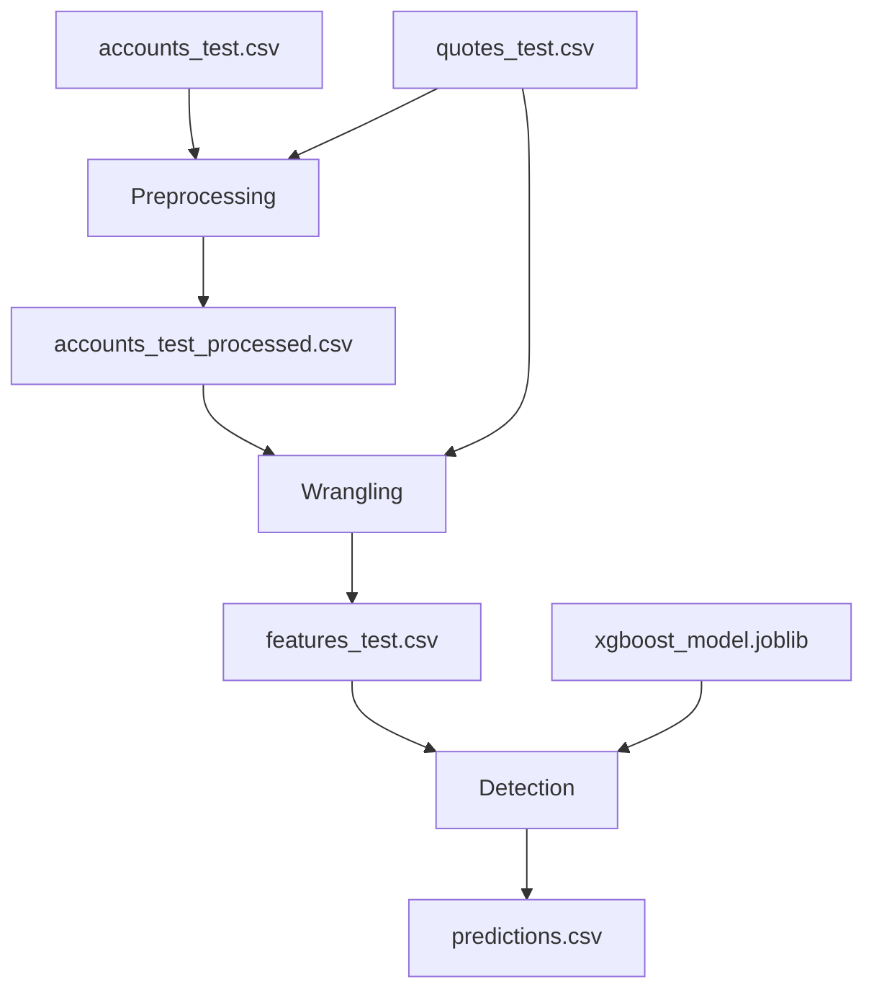

# CoverWallet Pipeline Execution Guide

## 🚀 Pipeline ML Completo

El pipeline ejecuta 3 pasos principales:
1. **Preprocessing**: Procesa datos de accounts y quotes
2. **Wrangling**: Feature engineering y encoding categórico
3. **Detection**: Genera predicciones con el modelo XGBoost

## 📋 Archivos Creados

### Scripts
- `src/detect.py` - Script de predicción con el modelo
- `airflow/dags/coverwallet_ml_pipeline.py` - DAG completo para Airflow
- `test_pipeline.sh` - Script para probar el pipeline localmente

### Configuración
- `docker-compose.yml` - Actualizado con volúmenes para el pipeline
- `test_payload.json` - Payload de ejemplo para testing de API

## 🏃‍♂️ Cómo Ejecutar

### Opción 1: Con Airflow (Recomendado)

```bash
# 1. Iniciar servicios
docker-compose up -d --build

# 2. Acceder a Airflow
open http://localhost:8080
# Login: admin / admin

# 3. En Airflow UI:
#    - Buscar DAG: 'coverwallet_ml_pipeline'
#    - Activar el DAG (toggle switch)
#    - Clickear "Trigger DAG" para ejecutar

# 4. Monitorear progreso en la UI
# 5. Verificar resultados en data/predictions.csv
```

### Opción 2: Localmente con Poetry

```bash
# 1. Hacer script ejecutable
chmod +x test_pipeline.sh

# 2. Ejecutar pipeline completo
./test_pipeline.sh

# O ejecutar paso a paso:
poetry run python src/preprocessing_data.py --config src/config/config_preprocess.yaml --dataset test
poetry run python src/wrangling.py --config src/config/config_wrangling.yaml --dataset test
poetry run python src/detect.py --model-path model/xgboost_model.joblib --features-file features_test.csv --output-file predictions.csv
```

### Opción 3: Solo Predicción (si ya tienes features_test.csv)

```bash
poetry run python src/detect.py \
  --model-path model/xgboost_model.joblib \
  --features-file features_test.csv \
  --output-file predictions.csv
```

## 📊 Flujo del Pipeline



## 🎯 Tareas del DAG de Airflow

1. **start_pipeline** - Inicio del pipeline
2. **check_input_files** - Verifica archivos de entrada
3. **run_preprocessing** - Ejecuta preprocessing
4. **run_wrangling** - Ejecuta feature engineering
5. **run_prediction** - Genera predicciones
6. **validate_results** - Valida formato y contenido
7. **send_notification** - Notificación de finalización
8. **end_pipeline** - Fin del pipeline

## 📁 Archivos de Entrada Requeridos

```
data/
├── accounts_test.csv      # Datos de cuentas de test
├── quotes_test.csv        # Datos de quotes de test
model/
└── xgboost_model.joblib   # Modelo entrenado
```

## 📁 Archivos de Salida Generados

```
data/
├── accounts_test_processed.csv  # Cuentas procesadas
├── features_test.csv           # Features finales para predicción
└── predictions.csv             # Predicciones finales (account_uuid, account_value)
```

## 🔧 Configuración de Volúmenes Docker

El `docker-compose.yml` está configurado para montar:

**Airflow**:
- `./airflow/dags` → `/opt/airflow/dags`
- `./model` → `/opt/airflow/model`
- `./data` → `/opt/airflow/data`
- `./src` → `/opt/airflow/src`

**FastAPI**:
- `./model` → `/model`
- `./data` → `/app/data`

## 🐛 Troubleshooting

### Error: "No module named 'src'"
```bash
# En Airflow container
export PYTHONPATH=/opt/airflow/src
```

### Error: "Model file not found"
```bash
# Verificar que el modelo existe
ls -la model/xgboost_model.joblib
```

### Error: "Features file not found"
```bash
# Ejecutar pasos previos del pipeline
poetry run python src/preprocessing_data.py --config src/config/config_preprocess.yaml --dataset test
poetry run python src/wrangling.py --config src/config/config_wrangling.yaml --dataset test
```

### Reiniciar Airflow
```bash
docker-compose restart airflow
# O completamente
docker-compose down && docker-compose up -d --build
```

## 📈 Monitoreo

### Logs de Airflow
```bash
docker-compose logs airflow
```

### Logs en tiempo real
```bash
docker-compose logs -f airflow
```

### Estado de tareas en Airflow UI
- Graph View: Vista gráfica del DAG
- Tree View: Vista temporal de ejecuciones
- Log View: Logs detallados de cada tarea

## ✅ Validación de Resultados

El script `detect.py` valida automáticamente:
- ✅ Todas las 37 features están presentes
- ✅ No hay valores nulos o infinitos
- ✅ Las predicciones son valores positivos
- ✅ El formato de salida es correcto (account_uuid, account_value)

## 🎉 Resultado Final

El archivo `data/predictions.csv` contiene:
```csv
account_uuid,account_value
7c7089b9-30cc6-c5fc-9f5c8-1e4ce6a8c3,1250.75
bf68dd36-7dc94-0f5d-ebad4-19c0cdcdc7,850.25
...
```

¡Pipeline listo para el challenge de CoverWallet! 🚀
